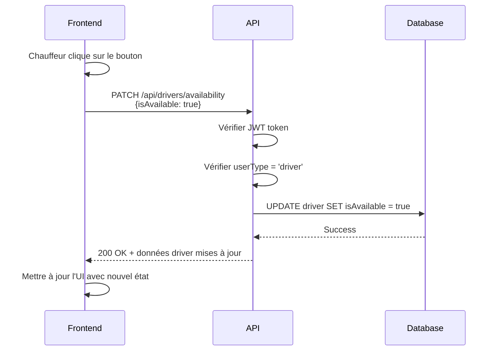

# 🚗 Bouton de Disponibilité Chauffeur - Guide Frontend

Documentation complète pour implémenter un bouton permettant au chauffeur de basculer sa disponibilité (disponible/indisponible).

---

## 📋 Vue d'ensemble

Le backend propose **un endpoint unique** pour mettre à jour la disponibilité d'un chauffeur :

| Endpoint | Méthode | URL | Type |
|----------|---------|-----|------|
| **Toggle Availability** | `PATCH` | `/api/drivers/availability` | API Platform (moderne) |

**Architecture :** Utilise les State Processors d'API Platform pour une architecture propre et maintenable.

---

## 🔐 Authentification

L'endpoint nécessite :
- ✅ Un token JWT valide
- ✅ L'utilisateur doit être de type "driver"
- ✅ Le driver doit avoir un profil créé

**Headers requis :**
```http
Authorization: Bearer eyJ0eXAiOiJKV1Qi...
Content-Type: application/json
```

---

## 📡 Endpoint API

### 🔹 Requête

**URL :** `PATCH http://localhost:8080/api/drivers/availability`

**Headers :**
```http
Authorization: Bearer <driver-token>
Content-Type: application/json
```

**Body :**
```json
{
  "isAvailable": true
}
```

**Valeurs possibles :**
- `true` → Chauffeur disponible pour recevoir des courses
- `false` → Chauffeur indisponible (hors ligne, en pause, etc.)

### 🔹 Réponses

#### ✅ Succès (200 OK)

```json
{
  "@context": "/api/contexts/Driver",
  "@id": "/api/drivers/1",
  "@type": "Driver",
  "id": 1,
  "user": {
    "@id": "/api/users/2",
    "id": 2,
    "email": "marie.martin@driver.com",
    "firstName": "Marie",
    "lastName": "Martin",
    "phone": "+33612345678",
    "userType": "driver",
    "rating": 4.8,
    "totalRides": 156
  },
  "vehicleModel": "Tesla Model 3",
  "vehicleType": "premium",
  "vehicleColor": "Noir",
  "currentLatitude": 48.8566,
  "currentLongitude": 2.3522,
  "licenceNumber": "ABC123456",
  "isVerified": true,
  "isAvailable": true
}
```

#### ❌ Erreur : Non authentifié (401 Unauthorized)

```json
{
  "code": 401,
  "message": "JWT Token not found"
}
```

#### ❌ Erreur : Pas un chauffeur (403 Forbidden)

```json
{
  "type": "https://tools.ietf.org/html/rfc2616#section-10",
  "title": "An error occurred",
  "detail": "Unauthorized",
  "status": 403
}
```

#### ❌ Erreur : Profil driver non trouvé (404 Not Found)

```json
{
  "type": "https://tools.ietf.org/html/rfc2616#section-10",
  "title": "An error occurred",
  "detail": "Driver profile not found",
  "status": 404
}
```

#### ❌ Erreur : Champ invalide (400 Bad Request)

```json
{
  "type": "https://tools.ietf.org/html/rfc2616#section-10",
  "title": "An error occurred",
  "detail": "isAvailable field is required and must be a boolean",
  "status": 400
}
```

---

## 🎨 Exemples d'Implémentation Frontend

### ⚛️ React / Next.js (TypeScript)

#### Composant avec Hook

```typescript
// components/DriverAvailabilityToggle.tsx
'use client';

import { useState } from 'react';
import { useAuth } from '@/hooks/useAuth'; // Votre hook d'authentification

interface DriverAvailabilityToggleProps {
  initialAvailability: boolean;
  driverId: number;
}

export default function DriverAvailabilityToggle({
  initialAvailability,
  driverId
}: DriverAvailabilityToggleProps) {
  const { token } = useAuth();
  const [isAvailable, setIsAvailable] = useState(initialAvailability);
  const [isLoading, setIsLoading] = useState(false);
  const [error, setError] = useState<string | null>(null);

  const toggleAvailability = async () => {
    setIsLoading(true);
    setError(null);

    try {
      const response = await fetch('http://localhost:8080/api/drivers/availability', {
        method: 'PATCH',
        headers: {
          'Authorization': `Bearer ${token}`,
          'Content-Type': 'application/json',
        },
        body: JSON.stringify({
          isAvailable: !isAvailable,
        }),
      });

      if (!response.ok) {
        const errorData = await response.json();
        throw new Error(errorData.detail || 'Erreur lors de la mise à jour');
      }

      const data = await response.json();
      setIsAvailable(data.isAvailable);
    } catch (err) {
      setError(err instanceof Error ? err.message : 'Une erreur est survenue');
      console.error('Erreur toggle availability:', err);
    } finally {
      setIsLoading(false);
    }
  };

  return (
    <div className="flex flex-col gap-2">
      <button
        onClick={toggleAvailability}
        disabled={isLoading}
        className={`
          px-6 py-3 rounded-lg font-semibold transition-all
          ${isAvailable
            ? 'bg-green-500 hover:bg-green-600 text-white'
            : 'bg-gray-400 hover:bg-gray-500 text-white'}
          ${isLoading ? 'opacity-50 cursor-not-allowed' : 'cursor-pointer'}
        `}
      >
        {isLoading ? (
          '⏳ Mise à jour...'
        ) : isAvailable ? (
          '✅ Disponible - Cliquer pour passer hors ligne'
        ) : (
          '⏸️ Hors ligne - Cliquer pour être disponible'
        )}
      </button>

      {error && (
        <div className="text-red-500 text-sm">
          ⚠️ {error}
        </div>
      )}
    </div>
  );
}
```

#### Utilisation du composant

```typescript
// app/driver/dashboard/page.tsx
import DriverAvailabilityToggle from '@/components/DriverAvailabilityToggle';

export default function DriverDashboard() {
  const driver = {
    id: 1,
    isAvailable: true,
    // ... autres données
  };

  return (
    <div className="p-6">
      <h1 className="text-2xl font-bold mb-4">Tableau de bord chauffeur</h1>

      <DriverAvailabilityToggle
        initialAvailability={driver.isAvailable}
        driverId={driver.id}
      />

      {/* Reste du dashboard */}
    </div>
  );
}
```

---

### 🟢 Vue.js 3 (Composition API)

```vue
<!-- components/DriverAvailabilityToggle.vue -->
<template>
  <div class="availability-toggle">
    <button
      @click="toggleAvailability"
      :disabled="isLoading"
      :class="[
        'toggle-btn',
        isAvailable ? 'available' : 'unavailable',
        { 'loading': isLoading }
      ]"
    >
      <span v-if="isLoading">⏳ Mise à jour...</span>
      <span v-else-if="isAvailable">✅ Disponible - Cliquer pour passer hors ligne</span>
      <span v-else>⏸️ Hors ligne - Cliquer pour être disponible</span>
    </button>

    <div v-if="error" class="error-message">
      ⚠️ {{ error }}
    </div>
  </div>
</template>

<script setup lang="ts">
import { ref } from 'vue';
import { useAuthStore } from '@/stores/auth'; // Votre store Pinia

interface Props {
  initialAvailability: boolean;
  driverId: number;
}

const props = defineProps<Props>();
const authStore = useAuthStore();

const isAvailable = ref(props.initialAvailability);
const isLoading = ref(false);
const error = ref<string | null>(null);

const toggleAvailability = async () => {
  isLoading.value = true;
  error.value = null;

  try {
    const response = await fetch('http://localhost:8080/api/drivers/availability', {
      method: 'PATCH',
      headers: {
        'Authorization': `Bearer ${authStore.token}`,
        'Content-Type': 'application/json',
      },
      body: JSON.stringify({
        isAvailable: !isAvailable.value,
      }),
    });

    if (!response.ok) {
      const errorData = await response.json();
      throw new Error(errorData.detail || 'Erreur lors de la mise à jour');
    }

    const data = await response.json();
    isAvailable.value = data.isAvailable;
  } catch (err) {
    error.value = err instanceof Error ? err.message : 'Une erreur est survenue';
    console.error('Erreur toggle availability:', err);
  } finally {
    isLoading.value = false;
  }
};
</script>

<style scoped>
.toggle-btn {
  padding: 12px 24px;
  border-radius: 8px;
  font-weight: 600;
  transition: all 0.3s ease;
  border: none;
  cursor: pointer;
}

.toggle-btn.available {
  background-color: #10b981;
  color: white;
}

.toggle-btn.available:hover {
  background-color: #059669;
}

.toggle-btn.unavailable {
  background-color: #9ca3af;
  color: white;
}

.toggle-btn.unavailable:hover {
  background-color: #6b7280;
}

.toggle-btn.loading {
  opacity: 0.5;
  cursor: not-allowed;
}

.error-message {
  margin-top: 8px;
  color: #ef4444;
  font-size: 14px;
}
</style>
```

---

### 📱 React Native

```typescript
// components/DriverAvailabilityToggle.tsx
import React, { useState } from 'react';
import { View, Text, TouchableOpacity, StyleSheet, ActivityIndicator } from 'react-native';
import AsyncStorage from '@react-native-async-storage/async-storage';

interface DriverAvailabilityToggleProps {
  initialAvailability: boolean;
  driverId: number;
}

export default function DriverAvailabilityToggle({
  initialAvailability,
  driverId
}: DriverAvailabilityToggleProps) {
  const [isAvailable, setIsAvailable] = useState(initialAvailability);
  const [isLoading, setIsLoading] = useState(false);
  const [error, setError] = useState<string | null>(null);

  const toggleAvailability = async () => {
    setIsLoading(true);
    setError(null);

    try {
      const token = await AsyncStorage.getItem('authToken');

      const response = await fetch('http://localhost:8080/api/drivers/availability', {
        method: 'PATCH',
        headers: {
          'Authorization': `Bearer ${token}`,
          'Content-Type': 'application/json',
        },
        body: JSON.stringify({
          isAvailable: !isAvailable,
        }),
      });

      if (!response.ok) {
        const errorData = await response.json();
        throw new Error(errorData.detail || 'Erreur lors de la mise à jour');
      }

      const data = await response.json();
      setIsAvailable(data.isAvailable);
    } catch (err) {
      setError(err instanceof Error ? err.message : 'Une erreur est survenue');
      console.error('Erreur toggle availability:', err);
    } finally {
      setIsLoading(false);
    }
  };

  return (
    <View style={styles.container}>
      <TouchableOpacity
        onPress={toggleAvailability}
        disabled={isLoading}
        style={[
          styles.button,
          isAvailable ? styles.available : styles.unavailable,
          isLoading && styles.loading,
        ]}
      >
        {isLoading ? (
          <ActivityIndicator color="#fff" />
        ) : (
          <Text style={styles.buttonText}>
            {isAvailable
              ? '✅ Disponible - Cliquer pour passer hors ligne'
              : '⏸️ Hors ligne - Cliquer pour être disponible'}
          </Text>
        )}
      </TouchableOpacity>

      {error && (
        <Text style={styles.error}>⚠️ {error}</Text>
      )}
    </View>
  );
}

const styles = StyleSheet.create({
  container: {
    marginVertical: 16,
  },
  button: {
    paddingVertical: 12,
    paddingHorizontal: 24,
    borderRadius: 8,
    alignItems: 'center',
    justifyContent: 'center',
  },
  available: {
    backgroundColor: '#10b981',
  },
  unavailable: {
    backgroundColor: '#9ca3af',
  },
  loading: {
    opacity: 0.5,
  },
  buttonText: {
    color: '#fff',
    fontWeight: '600',
    fontSize: 16,
  },
  error: {
    marginTop: 8,
    color: '#ef4444',
    fontSize: 14,
  },
});
```

---

## 🧪 Test avec cURL

### Passer en disponible

```bash
curl -X PATCH http://localhost:8080/api/drivers/availability \
  -H "Authorization: Bearer eyJ0eXAiOiJKV1Qi..." \
  -H "Content-Type: application/json" \
  -d '{
    "isAvailable": true
  }'
```

### Passer en indisponible

```bash
curl -X PATCH http://localhost:8080/api/drivers/availability \
  -H "Authorization: Bearer eyJ0eXAiOiJKV1Qi..." \
  -H "Content-Type: application/json" \
  -d '{
    "isAvailable": false
  }'
```

---

## 🔄 Workflow Complet



---

## 🎯 Bonnes Pratiques

### ✅ À faire

1. **Optimistic UI Update** - Mettre à jour l'UI immédiatement, puis confirmer avec la réponse :
   ```typescript
   const optimisticToggle = async () => {
     const newState = !isAvailable;
     setIsAvailable(newState); // Mettre à jour immédiatement

     try {
       const response = await updateAvailability(newState);
       setIsAvailable(response.isAvailable); // Confirmer avec la réponse
     } catch (error) {
       setIsAvailable(!newState); // Rollback en cas d'erreur
     }
   };
   ```

2. **Feedback visuel** - Indiquer clairement l'état actuel (couleur, icône, texte)
3. **Loading state** - Désactiver le bouton pendant la requête
4. **Gestion d'erreurs** - Afficher un message clair en cas d'échec
5. **Persistance locale** - Sauvegarder l'état localement pour éviter les requêtes inutiles

### ❌ À éviter

1. Ne pas vérifier la réponse de l'API
2. Permettre plusieurs clics simultanés
3. Ignorer les erreurs silencieusement
4. Ne pas donner de feedback à l'utilisateur

---

## 📊 Statut de Disponibilité vs État du Chauffeur

| Statut | `isAvailable` | Signification | Cas d'usage |
|--------|---------------|---------------|-------------|
| **Disponible** | `true` | Prêt à recevoir des courses | Chauffeur en service, attend des courses |
| **Indisponible** | `false` | Ne reçoit pas de nouvelles courses | Pause, fin de service, hors ligne |

**Note :** Un chauffeur en course peut rester `isAvailable: true` ou passer à `false` selon votre logique métier.

---

## 🔗 Endpoints Complémentaires

Pour une implémentation complète, vous aurez aussi besoin de :

| Endpoint | Description | Documentation |
|----------|-------------|---------------|
| `GET /api/driver/stats` | Statistiques du chauffeur | [DRIVER_AVAILABILITY_API.md](DRIVER_AVAILABILITY_API.md) |
| `GET /api/driver/history` | Historique des courses | [DRIVER_AVAILABILITY_API.md](DRIVER_AVAILABILITY_API.md) |
| `PATCH /api/drivers/location` | Mettre à jour la position GPS | [API_ENDPOINTS.md](API_ENDPOINTS.md) |

---

## 🐛 Troubleshooting

### Problème : "JWT Token not found"

**Cause :** Token manquant ou mal formaté

**Solution :**
```typescript
// ✅ Correct
headers: {
  'Authorization': `Bearer ${token}`
}

// ❌ Incorrect
headers: {
  'Authorization': token // Manque "Bearer "
}
```

---

### Problème : "Unauthorized" (403)

**Cause :** L'utilisateur n'est pas un chauffeur

**Solution :** Vérifier que `userType === 'driver'` lors de la connexion

---

### Problème : "Driver profile not found" (404)

**Cause :** Le user n'a pas de profil driver associé

**Solution :** Créer un profil driver via `POST /api/drivers` :
```json
{
  "user": "/api/users/{userId}",
  "vehicleModel": "Tesla Model 3",
  "vehicleType": "premium",
  "vehicleColor": "Noir",
  "currentLatitude": 48.8566,
  "currentLongitude": 2.3522,
  "licenceNumber": "ABC123456"
}
```

---

### Problème : CORS

**Cause :** Le frontend n'est pas autorisé à appeler l'API

**Solution :** Vérifier la configuration CORS dans `config/packages/nelmio_cors.yaml`

Voir [FRONTEND_CONNECTION_GUIDE.md](FRONTEND_CONNECTION_GUIDE.md) pour plus de détails.

---

## 💡 Améliorations Possibles

### 1. Notifications Push

Notifier le chauffeur quand des courses sont disponibles près de lui :
```typescript
if (isAvailable && hasNearbyRides) {
  sendPushNotification('Nouvelle course disponible près de vous !');
}
```

### 2. Durée de disponibilité

Ajouter un compteur pour suivre combien de temps le chauffeur est disponible :
```typescript
const [availableSince, setAvailableSince] = useState<Date | null>(null);

useEffect(() => {
  if (isAvailable) {
    setAvailableSince(new Date());
  } else {
    setAvailableSince(null);
  }
}, [isAvailable]);
```

### 3. Auto-switch après inactivité

Passer automatiquement en indisponible après X minutes sans interaction :
```typescript
useEffect(() => {
  if (isAvailable) {
    const timeout = setTimeout(() => {
      toggleAvailability(); // Auto switch to unavailable
    }, 30 * 60 * 1000); // 30 minutes

    return () => clearTimeout(timeout);
  }
}, [isAvailable]);
```

---

## 📞 Support

Pour toute question ou problème :
- **Issues :** [GitHub Issues](https://github.com/ifdev25/mini-uber-api/issues)
- **Email :** ishake.fouhal@gmail.com

---

## 🎯 Checklist d'Implémentation

- [ ] Endpoint testé avec cURL
- [ ] Composant créé avec gestion d'état
- [ ] Loading state implémenté
- [ ] Gestion d'erreurs ajoutée
- [ ] Feedback visuel clair (couleur, icône)
- [ ] Tests avec un vrai compte chauffeur
- [ ] UI/UX validée (accessible, responsive)
- [ ] Optimistic update optionnel ajouté

---

**🚀 L'endpoint est prêt à l'emploi ! Il ne reste plus qu'à implémenter le bouton dans votre frontend.**
